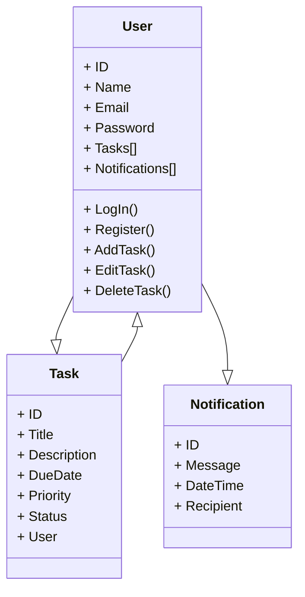

# sistema_agenda
Registro de testes

Projeto Criado para compor a nota da disciplina Teste de Software - Nele usamos CRUD/NODE.JS/PRISMA/SQLITE E JEST. Projeto de sistema de agendas com criação, edição e delete de tarefas. 

Integrantes: 
- José Lenildo ferreira da Silva 
- Gabriel da Silva Freire
- João Luiz Silva
- Sandro Anderson Neris dos Santos
- Moisés Vitor de Araújo candido

Link para a planilha de testes: https://docs.google.com/spreadsheets/d/1fJ8f296Frf-cGcgumA1WW1NNCRdwQ0ctOtE-yDC7zvk/edit?usp=sharing
